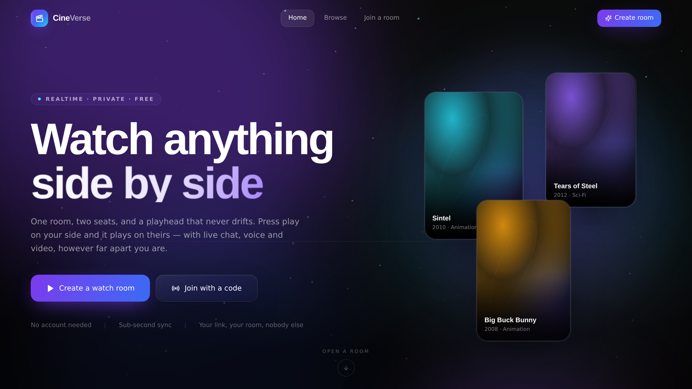
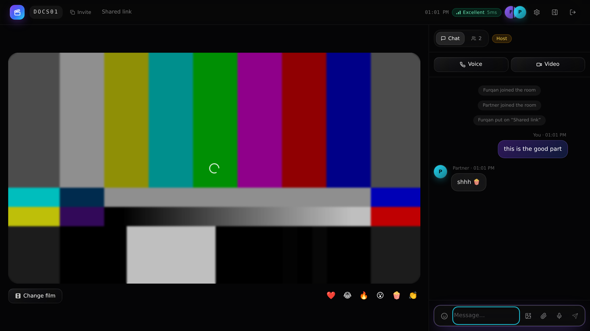
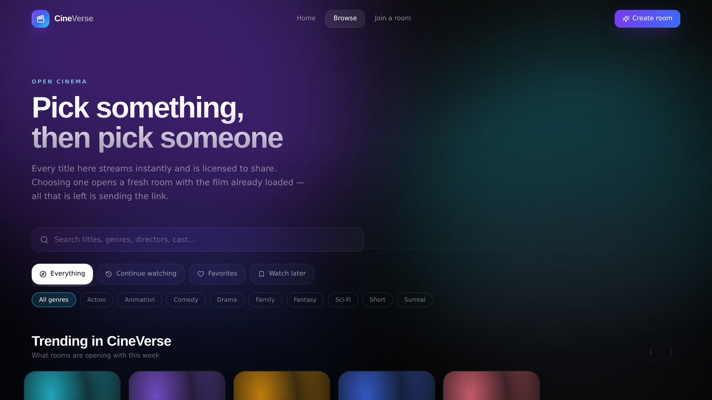
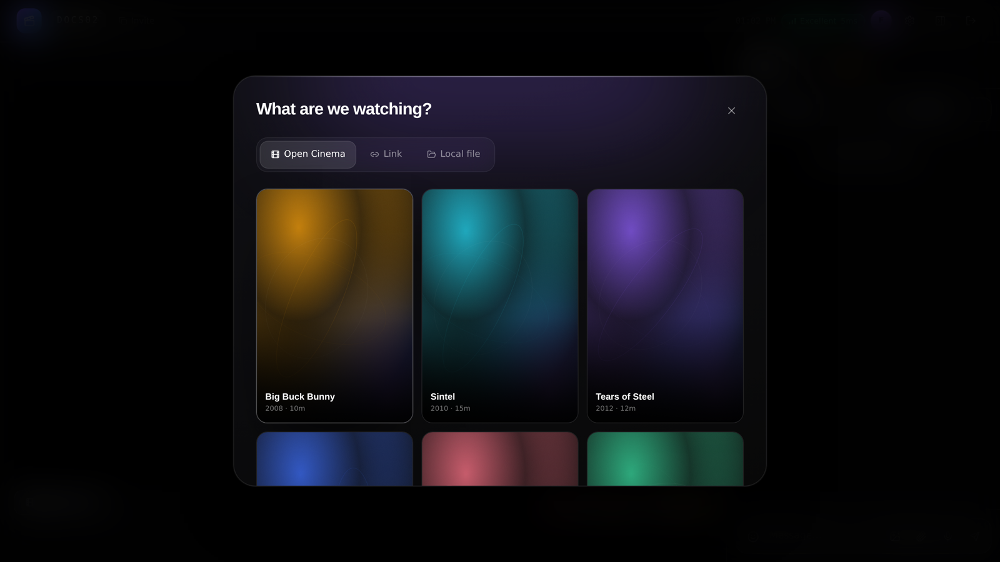
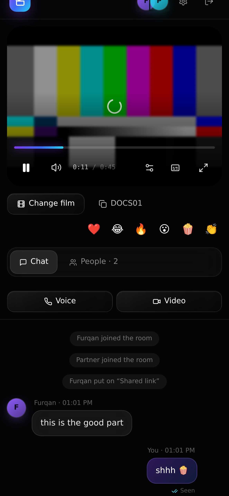

<div align="center">


# CineVerse

**A private cinema for two.** Perfectly synced playback, live chat, and calls —
in a room you open in one click and that disappears when you both leave.

[](https://github.com/Ahsan-muhd-444/cineverse/actions/workflows/ci.yml)
[](https://nextjs.org)
[](https://www.typescriptlang.org)
[](https://socket.io)
[](https://webrtc.org)
[](LICENSE)



</div>

---

## What it is

Two people, one film, the same second — however far apart they are.

Open a room, send the link, press play. From that moment every play, pause, seek
and speed change belongs to both of you. Beside the film there is a live chat
with typing indicators, read receipts, reactions, images, files and voice notes,
plus optional peer-to-peer voice and video calls with screen sharing.

There is no sign-up, nothing to install, and no database. A room exists only
while somebody is in it.

## Contents

- [Highlights](#highlights)
- [How the sync actually works](#how-the-sync-actually-works)
- [What you can watch](#what-you-can-watch)
- [Screens](#screens)
- [Getting started](#getting-started)
- [Deploying](#deploying)
- [Architecture](#architecture)
- [Testing](#testing)
- [Accessibility](#accessibility)
- [Performance](#performance)
- [Limitations](#limitations)
- [Contributing](#contributing)
- [License](#license)

## Highlights

|  | |
| --- | --- |
| **Sub-second sync** | Clock-aligned, latency-compensated, continuously drift-corrected. Measured at **0.20 s** between a laptop and a phone. |
| **Live chat** | Glass bubbles, typing indicators, read receipts, emoji and GIF board, image and file sharing, recorded voice notes with waveform playback. |
| **Voice and video** | Peer-to-peer WebRTC with echo cancellation and noise suppression, camera and mic toggles, screen sharing, live connection quality. |
| **Real rooms** | Invite links, passphrases, a waiting room the host approves, room locking, removing someone, handing over the host seat. |
| **Any source** | The built-in Open Cinema catalog, any direct video URL, a YouTube link, or the same local file you both already have. |
| **Designed, not templated** | A dark-first glass design system: aurora light fields, a cursor spotlight, drifting particles, spring motion, animated gradient borders. |
| **Actually accessible** | Full keyboard control, focus trapping, live regions, high-contrast mode, reduced-effects mode, `prefers-reduced-motion` honoured globally. |

## How the sync actually works

Keeping two browsers on the same frame is the whole point, so it is worth
explaining properly. Three mechanisms run at different rates.

**1 — Clock alignment.** Two machines never agree on `Date.now()`. On connect,
each client runs a miniature NTP handshake against the server: several round
trips, keep the lowest-latency half, take the median offset. From then on the
client can express any moment in the server's timeline.

**2 — Control events.** When someone presses play, the event carries their
playhead *and* the server timestamp at which it happened. The receiver adds the
transit time back in before seeking, so a 300 ms link does not become a 300 ms
desync.

**3 — Drift correction.** Every 2.5 s each client asks the server where the room
should be.

| Error | Response | Why |
| --- | --- | --- |
| under 250 ms | ignore | Chasing noise looks worse than tiny drift |
| 250 ms – 1.2 s | run playback 6% fast or slow until absorbed | Invisible to the viewer; no jump |
| over 1.2 s | hard seek | Too far gone to hide |

A heartbeat from whoever is playing keeps the server's extrapolation honest even
if one side buffers.

## What you can watch

| Source | How it works |
| --- | --- |
| **Open Cinema** | A built-in catalog of openly licensed films that stream instantly, so a new room never starts with an empty screen. |
| **Recommended movies** | A curated catalog of 40–50 **official** YouTube trailers across Punjabi, Bollywood and Hollywood. One click opens a room already playing the pick — both of you on the same synced player. Every link is verified live (`npm run validate:youtube-catalog`). |
| **Direct video URL** | Any `.mp4`, `.webm` or `.m3u8` link. |
| **YouTube** | Driven through the IFrame API and synced identically to a native video. |
| **A local file** | You each open your own copy. Nothing is uploaded, nothing is re-encoded, and the playheads are still kept in step. |

> **Deployment mode — demo/beta.** Hosted uploads (sharing one local file so both
> sides stream it, up to 3 GiB via S3 multipart) are fully built and tested but
> **disabled unless S3 is configured**: in production without an S3 bucket the
> picker shows *"Uploads are not available in this demo yet."* rather than writing
> real videos to an ephemeral disk. Built-in recommendations need no storage and
> work everywhere. Enabling hosted uploads (real S3 staging) and MKV→MP4
> conversion are tracked as future work.

## Screens

<table>
<tr>
<td width="50%"><br /><sub><b>The watch room</b> — player, live chat, participants, host controls.</sub></td>
<td width="50%"><br /><sub><b>Browse</b> — search, genres, continue watching, favorites, watch later.</sub></td>
</tr>
<tr>
<td><br /><sub><b>Choosing a source</b> — catalog, a link, or a local file.</sub></td>
<td align="center"><br /><sub><b>On a phone</b> — the same room, laid out for one hand.</sub></td>
</tr>
</table>

## Getting started

Requires Node 22.18.0 or newer (`.nvmrc` pins 22.18.0, and `package.json`
enforces it). The unit suites import `.ts` modules directly and rely on Node's
native type stripping, which is stable from 22.18.0.

```bash
git clone https://github.com/Ahsan-muhd-444/cineverse.git
cd cineverse
npm install
npm run dev
```

Open <http://localhost:3000>. There is nothing to configure — no database, no
API keys, no accounts.

> **Testing the room properly:** two tabs in the same browser profile share one
> Socket.IO connection and behave as a single participant. Use two different
> browsers, or one normal window and one private window.

| Script | What it does |
| --- | --- |
| `npm run dev` | Development server with hot reload |
| `npm run build` | Production build |
| `npm start` | Production server |
| `npm run typecheck` | Strict TypeScript, no emit |
| `npm test` | Unit suites (no server needed) |
| `npm run validate:youtube-catalog` | Verify every recommended link live via YouTube oEmbed |
| `node scripts/e2e-realtime.js` | 230+ realtime checks against a running server |
| `npm run release:gate` | Full gate from cold: build, unit, E2E, process smoke |

## Deploying

The repository ships with `render.yaml`, so on [Render](https://render.com):

1. **New → Blueprint**, point it at this repository.
2. Accept the detected service and deploy.

Render's free web services support WebSockets, which is what this needs. Any
host that runs a long-lived Node process works the same way — set `PORT` and run
`npm start`.

> Serverless platforms are **not** suitable. Socket.IO needs a persistent
> connection, which per-request function runtimes cannot hold open.

Optional environment variables — see [`.env.example`](.env.example):

| Variable | Purpose |
| --- | --- |
| `PORT` | Port to bind. Defaults to 3000; most hosts set it for you. |
| `NEXT_PUBLIC_SITE_URL` | Absolute URL used for social preview metadata. |

## Architecture

One Node process does two jobs: it serves the Next.js app and runs the
Socket.IO realtime layer. That is deliberate — it deploys as a single free
service, and the WebSocket shares the app's origin, so there is no cross-origin
handshake before sync can start.

```
server.js                     Next.js + Socket.IO in one process; all room state lives here
src/
├── app/                      Routes: home, browse, join, room/[code], error and 404 states
├── components/
│   ├── ui/                   Design-system primitives — button, glass card, modal, toasts
│   ├── fx/                   Aurora fields, cursor spotlight, particle canvas
│   ├── home/                 Hero, launchpad, showcase
│   ├── browse/               Catalog explorer, cards, detail sheet
│   ├── recommend/            Recommended-movies section and cards
│   └── room/                 Player, chat, calls, participants, host controls
├── data/                     Built-in recommendation catalog (verified official links)
├── hooks/                    useRoom, useSyncedPlayback, useWebRTC, useStartRoom
└── lib/                      Types, catalog, media, uploads, storage, socket + clock, helpers
server/                       Upload availability, storage adapters, limits, headers, config
scripts/                      Unit suites, realtime E2E, browser suites, release gate
```

**State.** Room state is server-authoritative and held in memory: members, the
playhead, room settings and a capped ring of recent chat. Personal preferences —
your name, favorites, watch-later, resume positions — stay in the browser's
`localStorage` and are never sent anywhere.

**The player abstraction.** `PlayerHandle` is a narrow interface (`getTime`,
`seek`, `play`, `pause`, …) implemented by both the HTML5 `<video>` engine and
the YouTube IFrame engine, so the sync layer never has to know which one is on
screen.

## Testing

```bash
npm run typecheck                 # strict TypeScript
npm test                          # unit suites (no server needed)
npm run build                     # production build
node scripts/e2e-realtime.js      # realtime suite, needs a running server
npm run release:gate              # everything above, from cold, on a free port
```

The realtime suite drives the Socket.IO layer with simulated clients and asserts
230+ behaviours: room creation and probing, presence, source propagation,
play/pause/seek in both directions, server-side playhead extrapolation while
playing and freezing while paused, chat delivery, typing, read receipts,
reactions, input sanitising, WebRTC signalling relay, room locking, the
passphrase gate, the waiting room approve/deny flow, kicking, host handover and
departure, the shared-upload pipeline, and per-event rate limiting. A separate
real-browser suite drives Chromium against a mock bucket to exercise the
resumable upload engine end to end. CI runs all of it on every push.

Grace-timer-driven assertions (host succession, orphaned-room closure, seat
expiry) require `ROOM_RECONNECT_GRACE_MS` to be set on the **server** process,
not only on the test client — otherwise the suite waits ~15 s against a 30 s
default and those checks time out.

## Accessibility

- Full keyboard control of the player: `Space`/`K` play-pause, `←`/`→` skip 5 s,
  `J`/`L` skip 10 s, `↑`/`↓` volume, `M` mute, `F` fullscreen, `C` subtitles,
  `P` picture-in-picture.
- Focus is trapped inside dialogs and restored on close; a skip-to-content link
  leads every page.
- Icon-only controls carry labels; chat is a live region; state changes announce.
- **High contrast** and **reduced effects** modes in room settings, and
  `prefers-reduced-motion` disables animation globally.
- Verified free of horizontal overflow from 360 px to 2560 px.

## Performance

Route-level code splitting, lazy-loaded imagery, artwork that falls back to
generated SVG posters if a remote image ever fails, a particle canvas that pauses when
the tab is hidden, and cursor effects written straight to CSS custom properties
inside a `requestAnimationFrame` so pointer movement never triggers a React
render.

First load is roughly 87 kB of shared JavaScript; the room route — the heaviest,
carrying the player, chat and WebRTC — is about 196 kB.

## Limitations

Stated plainly, because they are design decisions rather than bugs:

- **Commercial streaming services cannot be played.** Netflix, Prime and the
  rest block embedding. Use a direct file, a YouTube link, or a shared local
  copy.
- **Chat attachments are capped at 8 MB** and travel through the socket as data
  URLs. Good for photos and voice notes, not for sending someone a film.
- **Rooms are ephemeral.** Nothing is persisted; a room disappears shortly after
  everybody leaves.
- **Calls use public STUN only.** No TURN relay is configured, so a call may
  fail behind a symmetric NAT. Watching together is unaffected.
- **Free hosting tiers sleep when idle**, so the first request after a nap takes
  a few seconds.

## Contributing

Issues and pull requests are welcome — see [CONTRIBUTING.md](CONTRIBUTING.md)
for setup, the testing checklist, and notes on working safely inside the sync
engine. Please also read the [code of conduct](CODE_OF_CONDUCT.md). Security
reports go through the process in [SECURITY.md](SECURITY.md), not public issues.

## License

[MIT](LICENSE).

Films in the built-in catalog are Creative Commons works from the Blender
Institute and other open-media projects; each remains under its own licence.
